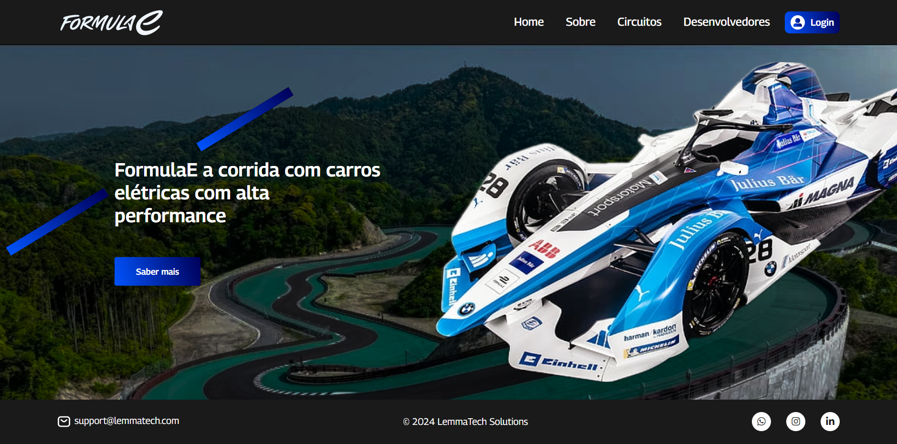

# Sistema Web - FormulaE

## Sobre
Este projeto foi desenvolvido para abordar um problema identificado pela Mahindra, a organização oficial da Fórmula E, relacionado à falta de visibilidade da categoria. Para solucionar essa questão, criamos um sistema web que funcionará como uma plataforma de divulgação, permitindo que as pessoas conheçam mais sobre a Fórmula E e interajam com o conteúdo. O sistema inclui diversas funcionalidades, como painéis de controle (dashboard), informações sobre os carros e corridas, além de um quiz interativo e jogável, projetado para aumentar o interesse e o engajamento do público com as corridas.

## Instruções
Para acessar o login utilize:
 - email: player@gmail.com
 - senha: 1234

Após o login você será redirecionado para o dashboard de visualização dos dados.

## Links

- [Figma](https://www.figma.com/design/vrP3ayZnWP8znxz65N6mTC/Sistema-Web---FormulaE?node-id=0-1&t=8X0K1NgZg2GYdqYy-1)

## Desenvolvedores
| Desenvolvedor | Avatar | RM |
| ------------- | ------ | -- |
|  |  | RM558270 |
|  |   | RM557929 |
|  |  | RM558358 |
|  |  | RM557531 |
|  |              |RM554682 |

